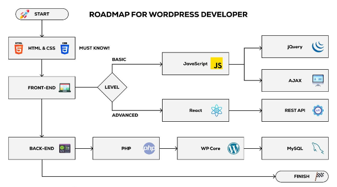

# How To Become A WordPress Developer In 2024: Complete Guide for Beginner

Greetings, I'm Ashkur Rahman, a seasoned WordPress developer with over 1 years of hands-on experience in crafting web solutions that seamlessly blend creativity and functionality. My journey in the world of web development has been fueled by a passion for creating engaging and user-friendly websites. During my career, I've honed my skills in theme and plugin development, optimized site performance, and ensured robust security practices. With a keen eye for design and a dedication to staying at the forefront of industry trends, I'm committed to delivering exceptional WordPress solutions that help businesses thrive in the digital landscape. Here's how you can master this skill.

# 1. Learn the Basics:
- HTML/CSS: Start with the basics of web development. Learn HTML for structuring content and CSS for styling.

- JavaScript: Familiarize yourself with JavaScript, as it's often used for interactivity and enhancing user experience.

- PHP: WordPress is built on PHP, so a solid understanding of PHP is crucial. Learn PHP syntax, functions, and object-oriented programming.

- SQL: Understand how to work with databases, as WordPress uses MySQL by default. Learn SQL for querying and managing data.

   

# 2. Get Comfortable with WordPress:

- Install WordPress: Set up a local development environment using tools like XAMPP or WAMP.

- Play with Themes: Experiment with creating and customizing WordPress themes. Study the template hierarchy, template tags, and the WordPress loop.

- Explore Plugins: Understand how plugins work, how to create custom plugins, and leverage existing ones.

- Learn the Core: Study the WordPress core code to understand its architecture and how it works.

   

# 3. Develop Your Skills:

- Theme Development: Dive deeper into theme development. Learn about custom post types, custom fields, and advanced template customization.

- Plugin Development: Build custom plugins for specific functionality or extend existing plugins.

- Security: Learn about WordPress security best practices, including data validation, escaping, and preventing common vulnerabilities.

- Performance Optimization: Explore techniques to improve WordPress site performance, such as optimizing images and leveraging caching.

- REST API: Understand how to use the WordPress REST API to create headless applications or integrate with other platforms.

   

# 4. Build Real Projects:
- Start working on personal or small client projects to gain practical experience

   

# 5. Explore Advanced Topics:

- Gutenberg Blocks: Learn how to create custom blocks for the Gutenberg editor.

- Multisite: Understand WordPress Multisite for managing multiple sites from a single installation.

- Custom Post Types and Taxonomies: Explore advanced content structuring with custom post types and taxonomies.

- eCommerce: If interested, learn how to create eCommerce sites using plugins like WooCommerce.

   

# 6. Stay Updated:
- Keep up with the latest WordPress developments, best practices, and coding standards by following WordPress blogs, forums, and attending WordCamps.

   

# 7. Collaborate and Network:
- Join WordPress developer communities online and attend local meetups or WordCamps to connect with other developers and learn from their experiences.

   

# 8. Build a Portfolio:
- Showcase your work by creating a portfolio website. Include the projects you've worked on and highlight your skills.

   

# 9. Seek Employment or Freelancing Opportunities:
- Apply for WordPress developer positions or start freelancing to gain professional experience.

# 10. Continuously Improve:
- Web development is an ever-evolving field. Stay updated with new technologies, coding standards, and design trends.

###  _Note: Remember that becoming a proficient WordPress developer takes time and practice. Be patient with yourself, keep learning, and don't be afraid to take on challenging projects to expand your skills._
